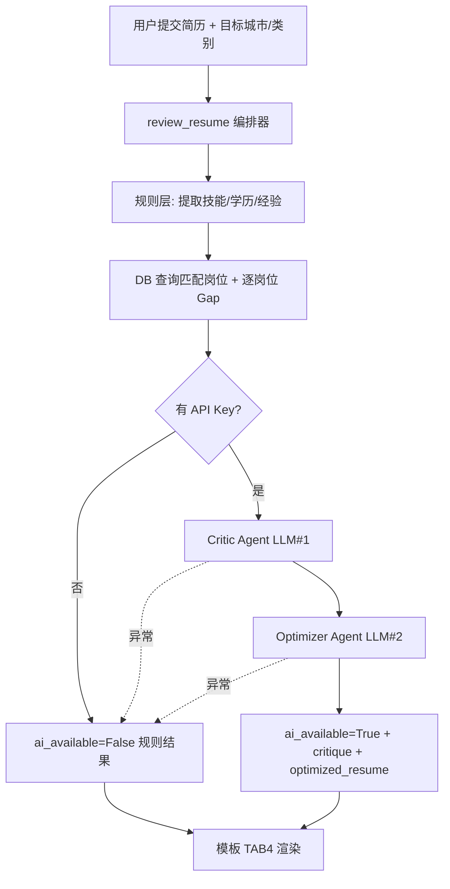

## 产品概述

将 advice 页面「简历审查与优化」(TAB 4) 从纯规则引擎升级为「双 Agent 协作审查模式」：保留规则层做结构化提取与逐岗位 Gap 分析，新增两个大模型调用——Critic Agent（批判/诊断）与 Optimizer Agent（优化/重写简历），形成「规则提取 → AI 诊断 → AI 优化」的完整链路，形成「分析-优化-投递」闭环。

## 核心功能

- 规则层：从简历提取技能/学历/经验，与数据库真实岗位 JD 做逐岗位 Gap 分析（保留现有逻辑，并修复 job_url 解包 NameError 缺陷）
- Critic Agent（LLM#1）：基于原始简历 + 提取画像 + 匹配岗位 Gap + 目标城市/类别，输出结构化诊断（优势、短板、ATS 关键词缺口、优先级）
- Optimizer Agent（LLM#2）：基于原始简历 + Critic 诊断 + 目标岗位要求，输出重写后的优化简历（关键词融入、项目经历重写、岗位定位）
- 优雅降级：未配置 API Key 或双模型均失败时不报错，返回规则版结果并标记 ai_available=False，前端提示「未启用 AI 深度分析」
- TAB 4 新增「AI 诊断报告」「AI 优化简历」两张卡片（优化简历支持一键复制），与现有提取画像/逐岗位 Gap 卡片共存
- 复用既有 `call_llm_with_fallback`（DeepSeek 主、千问备），不新增依赖、不新增路由

## 技术栈

- 后端：Flask + Jinja2（沿用现有架构，无前后端分离）
- AI 调用：复用 `agent/agent_core.py:204` 的 `call_llm_with_fallback`（DeepSeek 优先、千问 fallback，返回 (content, provider)）
- 模型：DeepSeek `deepseek-chat` / 通义 `qwen-plus`（密钥走 `.env` → `config.py`，绝不硬编码）
- 测试：pytest（沿用 `tests/test_agent_tools.py`，通过注入 mock `llm_call` 避免真实 API 调用）

## 实现策略

将 `review_resume()` 改造为**编排器（Orchestrator）**：

1. **规则层（数据准备）**：保留并修复现有提取+Gap 逻辑（修复 `agent_tools.py:760` 只解包 8 列、第 834 行 `job_url` 未定义导致的 NameError；SELECT 已是 9 列含 job_url，补上解包变量即可）。产出 `rule_result`。
2. **AI 层（双 Agent，串行）**：先调 Critic 生成 `critique`，再以其输出为输入调 Optimizer 生成 `optimized_resume`。两调用通过 `call_llm_with_fallback` 实现双模型 fallback。Optimizer 依赖 Critic，故串行（非并行）。
3. **优雅降级**：任意 LLM 调用抛异常（网络/限流/无 Key）→ 捕获后 `ai_available=False`，仍返回规则版 `rule_result`，页面正常渲染。

### 关键决策与权衡

- **为何串行而非并行**：Optimizer 必须基于 Critic 诊断才能产出针对性优化稿，存在硬依赖；并行无法保证输入完整。两次调用均在用户提交表单时触发，配合 advice 页面既有 loading 遮罩，延迟可接受（最坏 2 模型 × 2 重试 = 4 次请求）。
- **避免循环导入**：`agent_tools` 已被 `agent_core` 顶层 import；改为在 `review_resume` 函数体内**懒加载** `from agent.agent_core import call_llm_with_fallback`，运行时两模块均已加载，安全。
- **复用而非新建**：直接复用 `call_llm_with_fallback`，不新增 HTTP 客户端、不新增 Provider 抽象；密钥/重试/keep-alive 全部继承。
- **性能**：规则层与现有一致（一次 DB 查询 + 内存集合运算，O(岗位数×技能数)）；AI 层为按需两次 LLM 调用，非启动期、非高频路径，无性能瓶颈。

## 实现要点

- `review_resume(resume_text, target_city='', target_category='', llm_call=None)`：
- `llm_call` 默认 `None`；若为 `None` 且未配置任何 Key → 直接跳过 AI 层，`ai_available=False`。
- 若 `llm_call is None` 但有 Key → 用 `call_llm_with_fallback` 构造默认闭包（忽略 provider）。
- 注入 `llm_call` 便于测试 mock。
- 新增私有辅助函数 `_build_critic_messages(resume_text, rule_result, city, category)` 与 `_build_optimizer_messages(resume_text, critique, rule_result, city, category)`，集中构造 system+user prompt，保持 `review_resume` 主流程清晰。
- 返回结构在 `rule_result` 基础上追加：`critique`(str, markdown)、`optimized_resume`(str, markdown)、`ai_available`(bool)、`provider`(str)。
- Critic prompt 约束：仅基于注入的真实数据，禁止编造数字；输出分「优势/短板/ATS 关键词缺口/优先级」四段。
- Optimizer prompt 约束：输出可直接复制的优化简历全文（含融入关键词的项目经历 bullets），说明改了什么、为什么。

## 架构设计



## 目录结构与改动文件

```
project1-enhanced/
├── agent/
│   └── agent_tools.py     # [MODIFY] review_resume 改为编排器：修复 job_url 解包；新增 Critic/Optimizer 两次 LLM 调用（懒加载 call_llm_with_fallback）；新增 _build_critic_messages/_build_optimizer_messages；返回字典追加 critique/optimized_resume/ai_available/provider
├── templates/
│   └── advice.html        # [MODIFY] TAB4（id=tab-review）在 summary 与 job_gaps 之间新增「AI 诊断报告」「AI 优化简历」两张 warm-card，优化简历卡含一键复制按钮与 provider 徽标；ai_available=False 时显示降级提示；底部 JS 新增 copyText 函数
└── tests/
    └── test_agent_tools.py # [MODIFY] temp_db fixture 的 CREATE TABLE/INSERT 补齐 job_url 列；新增 review_resume 双 Agent 测试（mock llm_call 返回两段文本断言 critique/optimized_resume 与 ai_available=True）、降级测试（mock 抛异常断言 ai_available=False 且规则字段完整）、job_url 不再 NameError 测试
```

## 关键代码结构

```python
def review_resume(resume_text: str, target_city: str = '', target_category: str = '',
                  llm_call=None) -> dict:
    """返回 rule_result + {critique, optimized_resume, ai_available, provider}。
    llm_call: 可注入的 (messages)->str 闭包，便于测试；None 时按 Key 配置自动构造。"""

# 规则层返回（保持兼容）
# {extracted:{skills,edu,exper}, job_gaps:[...], summary, top_missing_skills,
#  critique:str, optimized_resume:str, ai_available:bool, provider:str}
```

## 设计风格

沿用 advice 页面既有「暖色调（warm）」设计语言（药丸导航 + warm-card 卡片 + 渐变 Hero），不引入新组件库，确保视觉一致性。TAB 4 在「总建议」卡片与「逐岗位 Gap 分析」之间，新增两张 AI 卡片，沿用 warm-card 圆角卡片、左侧主色描边、Noto Serif SC 标题等既有样式。

## 页面区块设计（TAB 4 新增）

- **AI 诊断报告卡片**：位于「总建议」之后。顶部 warm-card-header 带 🔍 图标与「AI 诊断报告」标题；正文以 `white-space:pre-wrap` 渲染 critique markdown（与现有 .answer-card 风格一致），保留换行。右上角显示 provider 徽标（deepseek/qwen）。
- **AI 优化简历卡片**：位于诊断报告之后。顶部带 ✨ 图标与「AI 优化简历」标题；正文 `pre-wrap` 渲染 optimized_resume；右上角「复制」按钮（调用 copyText），复制成功后按钮文案变「已复制 ✓」2 秒后复原；provider 徽标同诊断卡。
- **降级提示条**：当 `ai_available=False` 时，在 AI 卡片位置显示一条 warm-alert 风格提示「未启用 AI 深度分析，已为你展示规则版结果（配置 DEEPSEEK_API_KEY 后可获得 AI 诊断与优化）」。
- 两张 AI 卡片与既有提取画像、summary、job_gaps 卡片视觉层级一致，均使用暖橙主色（var(--warm-primary)）描边与标题，保证整体协调。

## Agent Extensions

### Skill

- **pdf**
- Purpose: 简历上传支持 PDF/Word，需从上传文件提取文本；当 extract_text 回退时辅助解析 PDF 简历内容
- Expected outcome: 用户上传的 PDF 简历可被正确提取为文本并注入 review_resume
- **docx**
- Purpose: 简历上传支持 Word 文档，需从 .docx 提取文本供 review_resume 分析
- Expected outcome: 用户上传的 Word 简历可被正确提取为文本并注入 review_resume